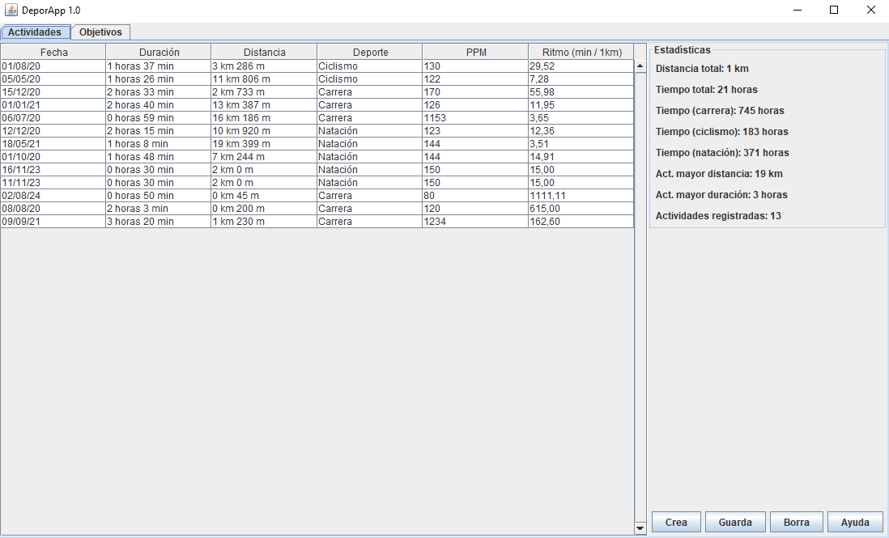

# Manual DeporApp

**DeporApp** es una aplicación que registra los datos de tus salidas deportivas para que puedas ver tus progresos.

---------------------

## Actividades

Aquí nos muestra una tabla con la información de las actividades que hemos ido guardando. La información que muestra es la siguiente:

- **Fecha**: indica la fecha en la que hiciste esa actividad.
- **Duración**: tiempo (en horas y minutos) que duró esa actividad.
- **Distancia**: distancia recorrida (en kilómetros y metros).
- **Deporte**: tipo de actividad (ciclismo, natación o carrera).
- **PPM**: pulsaciones por minuto de media.
- **Ritmo**: media de distancia por tiempo.

A la derecha de la tabla nos muestra las estadísticas totales de las actividades registradas.

------------------------

### Crear nueva actividad

Para crear una nueva actividad hay que seguir los siguientes pasos.

1) Pulsar al botón de 'Crea' situado abajo a la derecha.
2) Rellenar los campos de la nueva ventana.
3) Seleccionar el deporte.
4) Pulsar al botón de 'Guardar' de la ventana.
5) Se creará la nueva actividad y habrá que pulsar el botón 'Guarda' para finalizar.

---------------------

### Borrar actividad

Para borrar una actividad por si nos hemos confundido o no la queremos tener registrada hay que hacer lo siguiente:

1) Seleccionar una actividad (se pondrá en azul).
2) Pulsar el botón 'Borra'.

--------------

## Objetivos

Vemos unas gráficas con barras que nos muestran el camino que llevamos hacia nuestros distintos objetivos de las tres modalidades de deporte.

El objetivo de ciclismo son 80 km.\
El objetivo de carrera son 50 km.\
El objetivo de natación son 40 km.\

